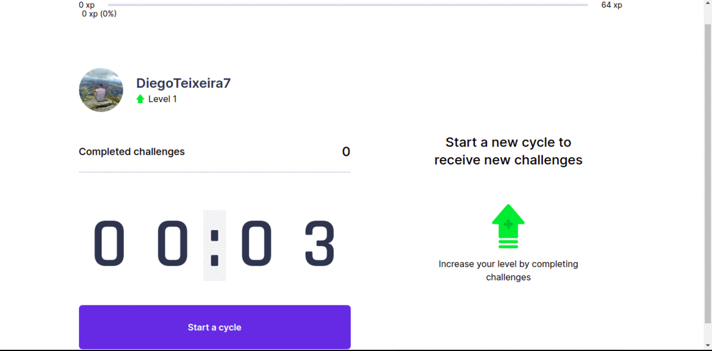

# :muscle: Move.it nuxt v1.0

<p align="center">
  
  
  
  
  
</p>

Essa aplicação foi desenvolvida no curso de Nuxt no canal do youtube
[Maiatto Dev](https://www.youtube.com/playlist?list=PL6GSB1I1APjqS1ligyQwHeVT0sAOWNkWH).
O move.it é um app que une a técnica de Pomodoro com a realização de exercícios
físicos para quem passa muito tempo na frente do computador.

## :computer: Tecnologias

Este projeto foi desenvolvido com as seguintes tecnologias:

-  [Nuxt](https://nuxtjs.org/)
-  [TailwindCSS](https://tailwindcss.com/docs)
-  [TypeScript](https://www.typescriptlang.org/)
-  [Vue](https://vuejs.org/)
-  [VS Code](https://code.visualstudio.com/)

### :arrow_forward: Em Execução:

<p align="center">
 
</p>

### :information_source: Como usar:

Para clonar e executar esta aplicação, você precisará do Git instalado em seu computador. Na linha de comando:

```bash
# Clonar este repositório
$ git clone https://github.com/DiegoTeixeira7/move.it.git

# Vá para o repositório
$ cd move.it

# Instale as dependências
$ sudo apt-get update && apt-get upgrade
$ yarn install	| npm install

# Execute o projeto

## Ambiente de desenvolvimento
$ $ yarn dev 	| npm run dev

## Ambiente de produção
$ yarn build 	| npm run build
$ yarn start	| npm run start

```
### :memo: Licença
Este projeto está sob a licença do MIT. Consulte a [LICENSE](LICENSE) para obter mais informações.
